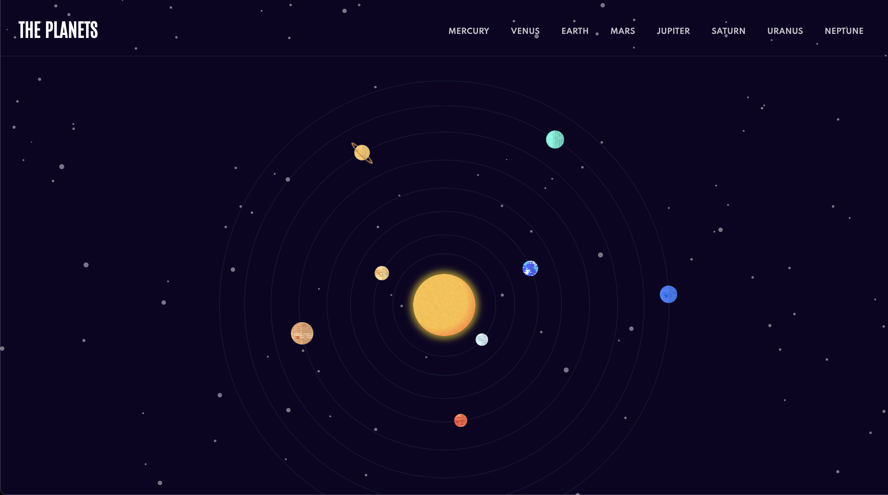

# Planets fact

Ce site présente les planètes du système solaire et inclut une animation du système solaire. Il a été créé à l'aide de React et SCSS. 

## Fonctionnalités

- Liste de toutes les planètes du système solaire
- Descriptions détaillées de chaque planète
- Anatomie du système solaire en temps réel
- Design élégant et interactif

## Comment utiliser

1. Clonez ce dépôt sur votre machine locale.
2. Installez les dépendances en exécutant `npm install`.
3. Lancez le serveur de développement en exécutant `npm start`.
4. Ouvrez un navigateur Web et accédez à l'adresse http://localhost:3000 pour accéder au site.

## Aperçu

## Accès au site

Le site est actuellement hébergé sur [planetsfact2.netlify.app](planetsfact2.netlify.app/).
